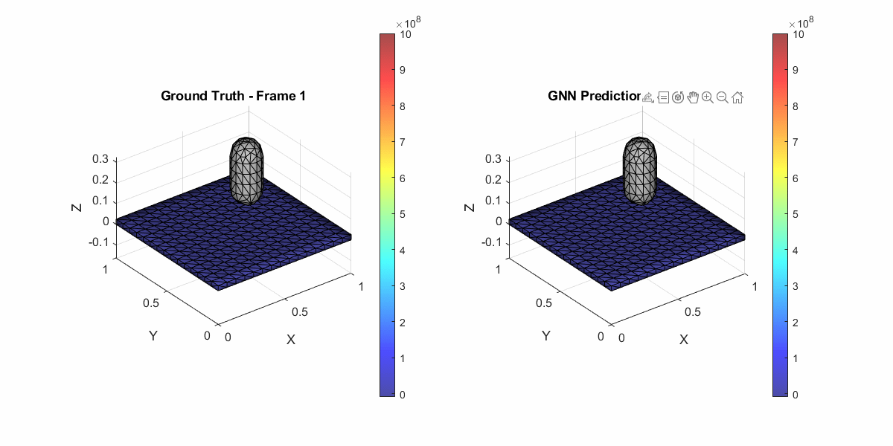
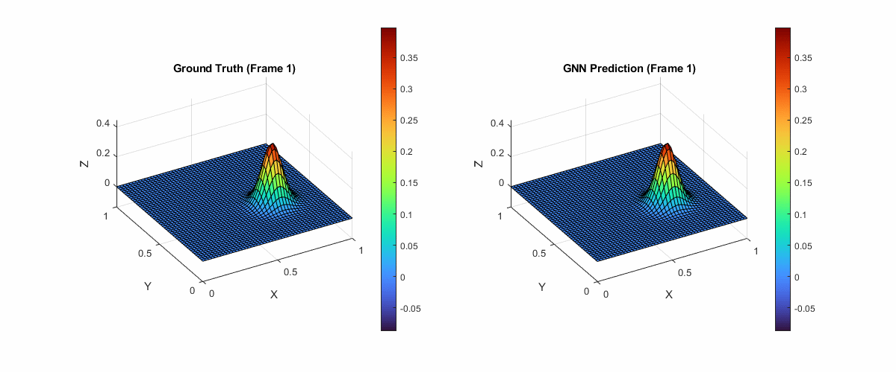
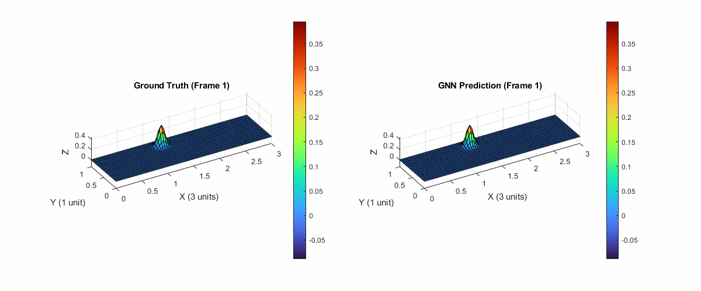
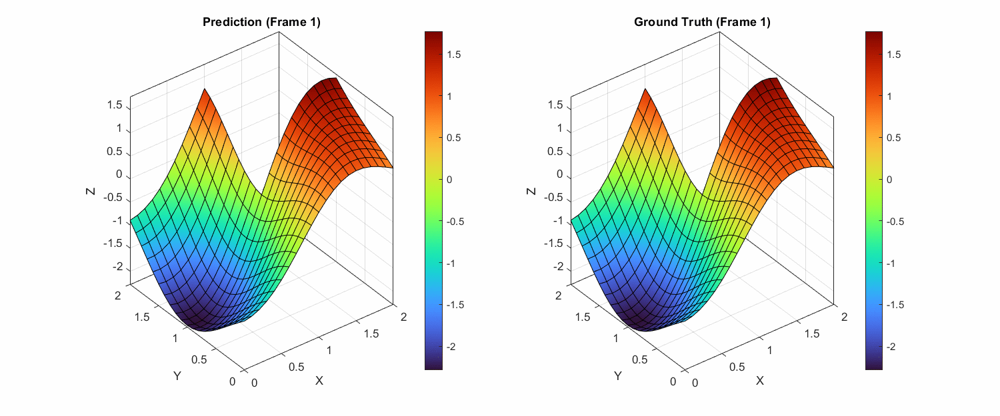

# Physics-guided Message Passing Iterations
[](10.5281/zenodo.18941082)


This repository contains the official implementation of the experiments from the paper On the under-reaching phenomenon in message passing
neural PDE solvers: revisiting the CFL condition 
(Tesan L. and Iparraguirre MM. 2025 et al.) 
[https://arxiv.org/pdf/2507.08861v1]


###  The Physics-Guided Lower-Bound (LB)
When the number of message passing iterations exceeds the physics-guided lower bound, the reach of the Graph Neural Network during each integration step is sufficient. This results in accurate predictions.
However, when the number of iterations is below this bound, the model fails due to insufficient information propagation.
In the case of this Elliptic problem the Physics-guided LB = 15.
#### ✅ Satisfied LB: 
Number of MPI = 16

#### ❌ Not Satisfied LB
Number of MPI = 4


### Zero-shot Extrapolation
Knowing the nature of the problem allows us not only to anticipate the required number of message passing iterations (MPI), but also to determine whether the trained model will be capable of extrapolating to unseen scenarios—and to identify which types of problems it can generalize to.
### Train Domain: 1x1

### Inference Domain: 3x1


### Non-convex Diffusion Geometry
Parabolic diffusion equations (like the heat equation) on non-convex manifolds or domains.
### ✅ Satisfied LB: 



## 📄 Abstract

We propose **physics-guided lower bounds** on the number of **message passing iterations** required in Graph Neural Networks (GNNs) to solve **Partial Differential Equations (PDEs)**. These bounds are derived from the physical characteristics of the underlying PDE system, providing a **theoretically grounded alternative to hyperparameter tuning**.

We show that:
- For **hyperbolic PDEs**, message propagation must **outpace the wave speed**, in the spirit of the CFL condition.
- For **parabolic and elliptic PDEs**, message passing must reach the entire domain due to **instantaneous propagation** in the governing equations.

Empirical validation on four PDE examples confirms the **theoretical bounds**.

---

## 📌 Key Contributions

- 📐 Theoretical lower bounds for number of message passing iterations in GNN PDE solvers.
- 🌊 CFL-inspired constraint for hyperbolic problems.
- 🌀 Global information propagation requirement for elliptic/parabolic problems.
- 🧪 Empirical validation on several benchmark PDEs using MeshGraphNet-based models.


---

## 🚆 Training and 🧪 Testing the Model

This repository supports **three families of PDE problems**: **hyperbolic**, **elliptic**, and **parabolic**. Each one requires:
1. Selecting the correct **dataset directory**.
2. Using the appropriate **model type** via the `--model` argument.

Below are examples for the **hyperbolic** case.

---

### 🏋️ Train on Hyperbolic PDEs

```bash
python main.py  --model gnn --dataset_dir data/HyperbolicLow --mp_steps 8 --epochs 100 --batch_size 8 --run_name hyperbolic_low
```
### 🏋️ Test model
```bash
python rollout.py  --pretrain_path outputs/checkpoints/hyperbolic_low/8MPI/models/topk1.pth  --split test  --model gnn --dataset_dir data/HyperbolicLow
```


### 🔧 Available Arguments

| Argument            | Type    | Default                         | Description |
|---------------------|---------|----------------------------------|-------------|
| `--batch_size`      | `int`   | `64`                             | Number of samples per training batch |
| `--epochs`          | `int`   | `1`                              | Number of training epochs |
| `--mp_steps`        | `int`   | `1`                              | Number of message-passing steps in the GNN |
| `--layers`          | `int`   | `2`                              | Number of layers in the GNN |
| `--hidden`          | `int`   | `10`                             | Number of hidden units per layer |
| `--lr`              | `float` | `1e-3`                           | Learning rate for the optimizer |
| `--noise`           | `float` | `0.1`                            | Standard deviation of noise added to input data |
| `--dataset_dir`     | `str`   | `'data/Lowres_Waves/dataset'`    | Path to dataset directory |
| `--run_name`        | `str`   | `"Tester"`                      | Unique identifier for the training run |
| `--model`           | `str`   | `"meshgraph"`                   | Model type: `meshgraph`, `gnn`, or `poisson` |


## 📚 Citation

If you use this code or build upon our work, please cite the following paper:

`@misc{tesan&iparraguirre2025,
      title={On the under-reaching phenomenon in message-passing neural PDE solvers: revisiting the CFL condition}, 
      author={Lucas Tesan and Mikel M. Iparraguirre and David Gonzalez and Pedro Martins and Elias Cueto},
      year={2025},
      eprint={2507.08861},
      archivePrefix={arXiv},
      primaryClass={cs.LG},
      url={https://arxiv.org/abs/2507.08861}, 
}
`
